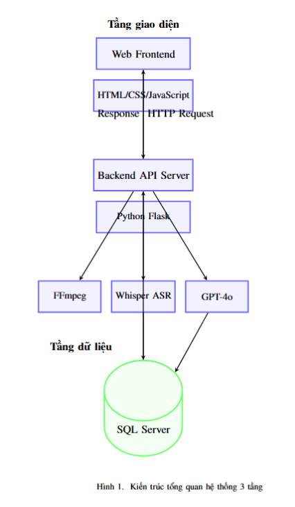
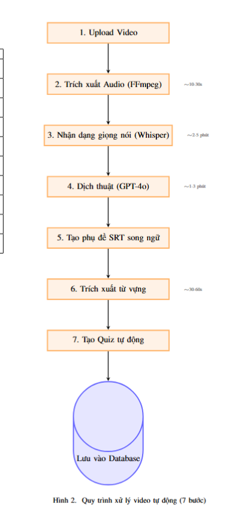
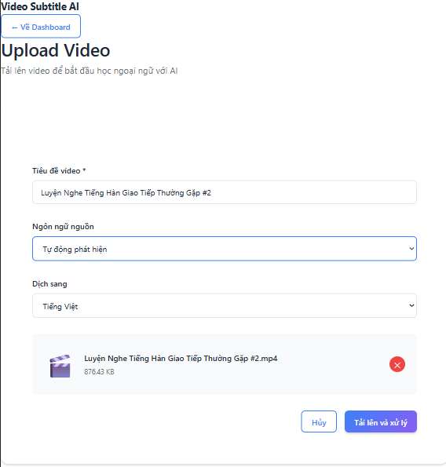
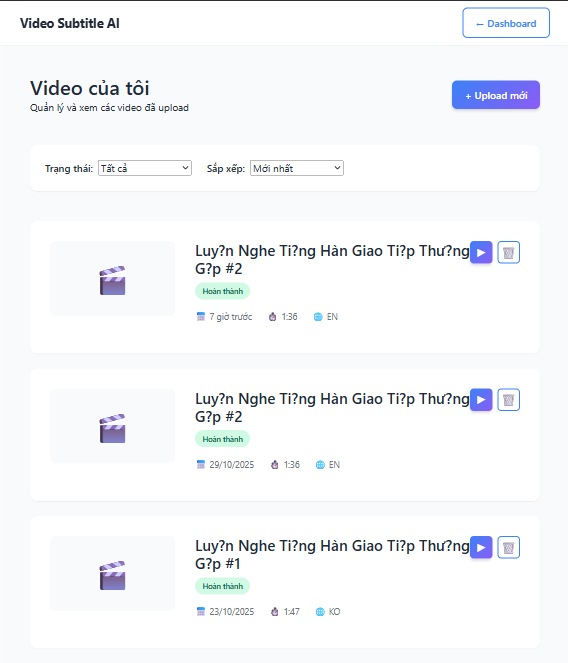
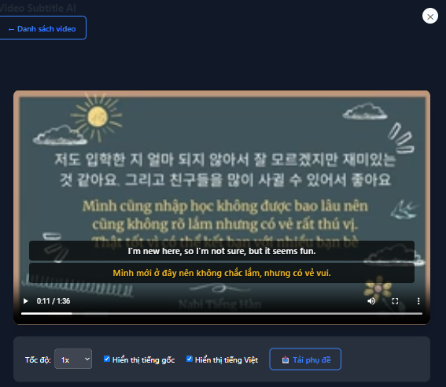
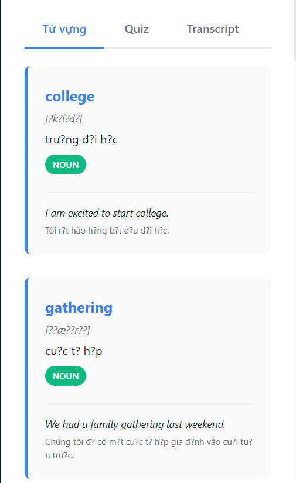
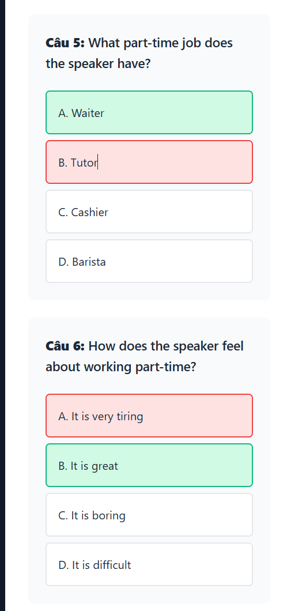
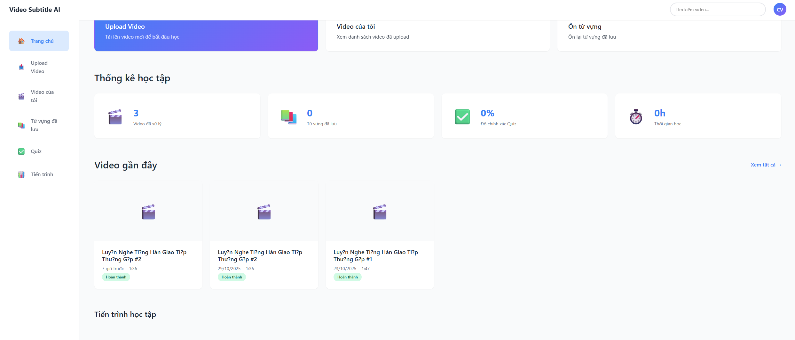

<h1 align="center">HỆ THỐNG TRÍCH XUẤT PHỤ ĐỀ VÀ DỊCH THUẬT <br/> VIDEO TỰ ĐỘNG ỨNG DỤNG TRÍ TUỆ NHÂN TẠO <br/> ĐỂ PHỤC VỤ HỌC TẬP NGOẠI NGỮ</h1>

<div align="center">

<p align="center">
  
  
</p>

[](https://github.com/chuvanhuy)
[](https://fitdnu.net/)
[](https://dainam.edu.vn)

</div>

<h2 align="center">AN AUTOMATIC VIDEO SUBTITLE EXTRACTION AND TRANSLATION SYSTEM <br/> USING ARTIFICIAL INTELLIGENCE FOR FOREIGN LANGUAGE LEARNING</h2>

<p align="left">
  Hệ thống trích xuất phụ đề và dịch thuật video tự động sử dụng công nghệ trí tuệ nhân tạo (Whisper, GPT-4o) để hỗ trợ học ngoại ngữ. Ứng dụng này cho phép người dùng upload video, tự động tạo phụ đề song ngữ, trích xuất từ vựng quan trọng, và tạo quiz kiểm tra hiểu biết qua giao diện web thân thiện.
</p>

---

## 🌟 Giới thiệu

- **🎥 Nhận dạng giọng nói tự động:** Hệ thống sử dụng Whisper large-v3 của OpenAI để chuyển đổi audio thành text với độ chính xác 93.2%, hỗ trợ 99+ ngôn ngữ.
- **🌐 Dịch thuật chất lượng cao:** Sử dụng GPT-4o để dịch sang tiếng Việt với BLEU score 0.88, giữ nguyên ngữ cảnh và sắc thái văn hóa.
- **📝 Phụ đề song ngữ đồng bộ:** Tạo file SRT chuẩn với timestamp chính xác, hiển thị đồng thời tiếng gốc và tiếng Việt.
- **📚 Trích xuất từ vựng thông minh:** GPT-4o phân tích semantic và chọn từ vựng quan trọng, kèm phiên âm IPA, ví dụ và phân loại độ khó (A1-C2).
- **✅ Quiz tự động:** Tự động sinh câu hỏi trắc nghiệm và điền từ với 3 mức độ khó (easy 30%, medium 50%, hard 20%).
- **📊 Theo dõi tiến độ:** Lưu lịch sử học tập, từ vựng đã học, và kết quả quiz để đánh giá quá trình học.

---

## 🏗️ KIẾN TRÚC HỆ THỐNG

### Kiến trúc tổng quan

<p align="center">
  
</p>

**Kiến trúc 3-tier:**
- **Tầng giao diện (Web Frontend):** HTML/CSS/JavaScript - Giao diện người dùng thân thiện
- **Tầng xử lý (Backend API Server):** Python Flask - Xử lý logic nghiệp vụ và điều phối các AI models
- **Tầng dữ liệu (SQL Server):** Lưu trữ users, videos, transcripts, translations, vocabulary, quiz

**Các thành phần xử lý AI:**
- **FFmpeg:** Trích xuất audio từ video (10-30s)
- **Whisper ASR:** Nhận dạng giọng nói sang text (2-5 phút)
- **GPT-4o:** Dịch thuật, trích xuất từ vựng, tạo quiz (1-3 phút)

### Quy trình xử lý video tự động

<p align="center">
  
</p>

**7 bước xử lý tự động:**

1. **Upload Video** (5-10s)
   - Validate: file type, size (<500MB), duration (<30min)
   - Save to `/uploads` directory
   
2. **Trích xuất Audio** (~10-30s)
   - FFmpeg: Convert video → WAV 16kHz mono
   - Save to `/audio` directory
   
3. **Nhận dạng giọng nói** (~2-5 phút)
   - Whisper large-v3: Audio → Text + Timestamps
   - Store segments in database
   
4. **Dịch thuật** (~1-3 phút)
   - GPT-4o: Translate to Vietnamese
   - Context-aware, preserve cultural nuances
   
5. **Tạo phụ đề SRT song ngữ** (~5-10s)
   - Format: Original + Vietnamese
   - Standard SRT with timestamps
   
6. **Trích xuất từ vựng** (~30-60s)
   - GPT-4o: Semantic analysis
   - IPA phonetic + Examples + CEFR level
   
7. **Tạo Quiz tự động** (~20-30s)
   - 10 questions: Multiple choice + Fill-blank
   - 3 difficulty levels: Easy/Medium/Hard

**Lưu vào Database:** All processed data stored in SQL Server, ready for user access

**Tổng thời gian:** 4-6 phút cho video 2 phút

---

## 📂 Cấu trúc dự án

```
📦 Video-Subtitle-Translation-System
├── 📂 backend                           # Backend API và xử lý AI
│   ├── 📂 services                      # Các service xử lý
│   │   ├── whisper_service.py          # Service nhận dạng giọng nói
│   │   ├── gpt_service.py              # Service dịch thuật và trích xuất
│   │   ├── ffmpeg_service.py           # Service xử lý video/audio
│   │   └── srt_service.py              # Service tạo phụ đề
│   ├── 📂 routes                        # API endpoints
│   │   ├── auth.py                     # Authentication routes
│   │   ├── video.py                    # Video processing routes
│   │   └── quiz.py                     # Quiz routes
│   ├── 📂 models                        # Database models
│   │   ├── user.py                     # User model
│   │   ├── video.py                    # Video model
│   │   └── vocabulary.py               # Vocabulary model
│   ├── 📂 uploads                       # Thư mục lưu video upload
│   ├── 📂 audio                         # Thư mục lưu audio trích xuất
│   ├── 📂 subtitles                     # Thư mục lưu file SRT
│   ├── app.py                          # Main Flask application
│   ├── config.py                       # Configuration settings
│   └── requirements.txt                # Python dependencies
│
├── 📂 frontend                          # Frontend giao diện người dùng
│   ├── 📂 pages                         # Các trang web
│   │   ├── index.html                  # Trang chủ
│   │   ├── login.html                  # Đăng nhập
│   │   ├── dashboard.html              # Dashboard chính
│   │   ├── upload.html                 # Upload video
│   │   ├── player.html                 # Video player
│   │   ├── vocabulary.html             # Quản lý từ vựng
│   │   ├── quiz.html                   # Làm quiz
│   │   └── transcript.html             # Xem transcript
│   ├── 📂 css                           # Stylesheets
│   │   └── style.css                   # Main stylesheet
│   ├── 📂 js                            # JavaScript files
│   │   ├── api.js                      # API calls
│   │   ├── auth.js                     # Authentication logic
│   │   └── player.js                   # Video player logic
│   └── 📂 assets                        # Images, fonts, etc.
│
├── 📂 database                          # Database scripts
│   ├── schema.sql                      # Database schema
│   └── sample_data.sql                 # Sample data for testing
│
├── 📂 docs                              # Documentation
│   ├── BaoCao_DoAn_ChuVanHuy.tex      # Báo cáo LaTeX
│   ├── README_BaoCao.txt               # Hướng dẫn báo cáo
│   └── API_Documentation.md            # API documentation
│
├── 📂 images                            # Images cho README
│   ├── logoDaiNam.png                  # Logo trường
│   ├── system-architecture.png         # Sơ đồ kiến trúc
│   └── screenshots/                    # Screenshots giao diện
│
├── .gitignore                          # Git ignore file
├── README.md                           # This file
└── LICENSE                             # License file
```

---

## 🛠️ CÔNG NGHỆ SỬ DỤNG

<div align="center">

### 🤖 AI/ML Models
[](https://github.com/openai/whisper)
[](https://openai.com/gpt-4)
[](https://ffmpeg.org/)

### 🖥️ Backend
[](https://www.python.org/)
[](https://flask.palletsprojects.com/)
[](https://www.microsoft.com/sql-server)

### 🎨 Frontend
[](https://html.spec.whatwg.org/)
[](https://www.w3.org/Style/CSS/)
[](https://www.javascript.com/)
[](https://videojs.com/)

### 📚 Key Libraries
[](https://openai.com/)
[](https://numpy.org/)
[](https://pandas.pydata.org/)
[](https://github.com/mkleehammer/pyodbc)

</div>

---

## 🛠️ Yêu cầu hệ thống

### 🔌 Phần cứng tối thiểu
- **CPU:** Intel Core i5 hoặc tương đương (khuyến nghị i7)
- **RAM:** 8GB (khuyến nghị 16GB)
- **GPU:** NVIDIA GTX 1650 4GB VRAM trở lên (khuyến nghị RTX 3060)
- **Storage:** 20GB SSD trống
- **Internet:** Kết nối ổn định cho API calls (OpenAI)

### 💻 Phần mềm
- **Hệ điều hành:** Windows 10/11, Ubuntu 20.04+, hoặc macOS 12+
- **Python:** 3.11+ (với pip)
- **Node.js:** 16+ (nếu cần build frontend)
- **SQL Server:** 2019+ hoặc 2022
- **FFmpeg:** 6.0+
- **CUDA Toolkit:** 12.1+ (cho GPU acceleration)

### 📦 Python Dependencies
```txt
flask==3.0.0
flask-cors==4.0.0
openai==1.6.1
whisper==1.0.0
torch==2.1.0
torchaudio==2.1.0
opencv-python==4.8.1
numpy==1.24.3
pandas==2.0.3
pyodbc==4.0.39
python-dotenv==1.0.0
pydub==0.25.1
```

---

## 🚀 Hướng dẫn cài đặt và chạy

### 1️⃣ Clone repository

```bash
git clone https://github.com/chuvanhuy/video-subtitle-translation.git
cd video-subtitle-translation
```

### 2️⃣ Cài đặt Backend

**a) Tạo virtual environment:**

```bash
cd backend
python -m venv venv

# Windows
venv\Scripts\activate

# Linux/Mac
source venv/bin/activate
```

**b) Cài đặt dependencies:**

```bash
pip install -r requirements.txt
```

**c) Cài đặt FFmpeg:**

**Windows:**
```bash
# Download từ: https://ffmpeg.org/download.html
# Giải nén và thêm vào PATH
```

**Ubuntu/Debian:**
```bash
sudo apt update
sudo apt install ffmpeg
```

**macOS:**
```bash
brew install ffmpeg
```

**d) Cấu hình environment variables:**

Tạo file `.env` trong thư mục `backend/`:

```env
# OpenAI API
OPENAI_API_KEY=your_openai_api_key_here

# Database
DB_SERVER=localhost
DB_NAME=VideoSubtitleDB
DB_USER=sa
DB_PASSWORD=your_password

# Flask
FLASK_ENV=development
FLASK_DEBUG=True
SECRET_KEY=your_secret_key_here

# Upload
MAX_VIDEO_SIZE=500  # MB
UPLOAD_FOLDER=uploads
AUDIO_FOLDER=audio
SUBTITLE_FOLDER=subtitles
```

### 3️⃣ Cài đặt Database

**a) Tạo database trong SQL Server:**

```sql
CREATE DATABASE VideoSubtitleDB;
GO

USE VideoSubtitleDB;
GO
```

**b) Chạy schema script:**

```bash
# Trong SQL Server Management Studio
# Mở và execute file: database/schema.sql
```

Hoặc dùng command line:

```bash
sqlcmd -S localhost -U sa -P your_password -i database/schema.sql
```

### 4️⃣ Cài đặt Frontend

**a) Serve static files với Python:**

```bash
cd frontend
python -m http.server 3000
```

**b) Hoặc dùng Node.js (tùy chọn):**

```bash
cd frontend
npm install -g http-server
http-server -p 3000
```

### 5️⃣ Chạy ứng dụng

**Terminal 1 - Backend:**

```bash
cd backend
python app.py
```

Backend sẽ chạy trên: `http://127.0.0.1:5000`

**Terminal 2 - Frontend:**

```bash
cd frontend
python -m http.server 3000
```

Frontend sẽ chạy trên: `http://localhost:3000`

### 6️⃣ Truy cập ứng dụng

Mở trình duyệt và vào: **http://localhost:3000**

**Tài khoản test mặc định:**
- Username: `admin`
- Password: `admin123`

---

## 📖 Hướng dẫn sử dụng

### 1️⃣ Đăng ký / Đăng nhập

<p align="center">
  
</p>

- Truy cập trang đăng nhập
- Nhập username và password
- Hệ thống sẽ tạo JWT token để xác thực

### 2️⃣ Upload Video

<p align="center">
  
</p>

**Các bước:**
1. Click vào **"Upload Video"** trên menu
2. Chọn file video từ máy tính (hỗ trợ: mp4, avi, mov, mkv)
3. Nhập tiêu đề cho video
4. Chọn ngôn ngữ gốc (English, Korean, Japanese, v.v.)
5. Click **"Upload"**

**Lưu ý:**
- Kích thước tối đa: 500MB
- Độ dài tối đa: 30 phút
- Chất lượng audio: rõ ràng, ít nhiễu

### 3️⃣ Xử lý Video

<p align="center">
  
</p>

Sau khi upload, hệ thống tự động:
1. ✅ Trích xuất audio (10-30s)
2. ✅ Nhận dạng giọng nói với Whisper (2-5 phút)
3. ✅ Dịch thuật với GPT-4o (1-3 phút)
4. ✅ Tạo phụ đề SRT song ngữ (5-10s)
5. ✅ Trích xuất từ vựng (30-60s)
6. ✅ Tạo quiz (20-30s)

**Tổng thời gian:** 4-6 phút cho video 2 phút

### 4️⃣ Xem Video với Phụ đề

<p align="center">
  
</p>

**Tính năng:**
- ▶️ Phát video với phụ đề song ngữ đồng bộ
- 🔄 Bật/tắt phụ đề tiếng gốc hoặc tiếng Việt
- ⏱️ Điều chỉnh thời gian hiển thị phụ đề
- 📥 Download file SRT về máy
- 🔍 Tìm kiếm từ trong transcript

### 5️⃣ Học Từ vựng

<p align="center">
  
</p>

**Chức năng:**
- 📚 Xem danh sách từ vựng quan trọng
- 🔊 Nghe phát âm (text-to-speech)
- 💾 Lưu từ vào danh sách học
- 🎴 Flashcard mode để ôn tập
- 📊 Phân loại theo độ khó (Basic, Intermediate, Advanced)
- 📝 Xem ví dụ và phiên âm IPA

**Ví dụ entry:**
```
Word: gathering
Phonetic: /ˈɡæðərɪŋ/
Part of Speech: noun
Definition: a meeting or assembly of people
Example: There are so many gatherings at college.
Translation: cuộc tụ họp, buổi gặp mặt
Level: intermediate
```

### 6️⃣ Làm Quiz

<p align="center">
  
</p>

**Dạng câu hỏi:**
- ✏️ Multiple choice (80%)
- ✏️ Fill in the blank (20%)

**Mức độ:**
- 🟢 Easy (30%): Recall trực tiếp từ video
- 🟡 Medium (50%): Cần hiểu ngữ cảnh
- 🔴 Hard (20%): Cần suy luận hoặc kiến thức từ vựng

**Sau khi hoàn thành:**
- 📊 Xem điểm số và đánh giá
- 📝 Xem giải thích cho từng câu
- 📈 Lưu vào lịch sử học tập

### 7️⃣ Theo dõi Tiến độ

<p align="center">
  
</p>

**Thống kê:**
- 📹 Số video đã học
- 📚 Số từ vựng đã lưu
- ✅ Số quiz đã hoàn thành
- 📊 Điểm trung bình
- 📅 Biểu đồ tiến độ theo thời gian

---

## ⚙️ Cấu hình nâng cao

### 1. Tối ưu hóa Performance

**a) Sử dụng Whisper model nhỏ hơn:**

Trong `backend/services/whisper_service.py`:

```python
# Fast mode (3x faster, 1-2% accuracy loss)
model = whisper.load_model("medium")  # Thay vì "large-v3"
```

**b) Batch GPT-4o requests:**

Trong `backend/services/gpt_service.py`:

```python
# Tăng batch size
batch_size = 15  # Thay vì 10
```

**c) GPU optimization:**

```python
# Enable FP16 inference
result = model.transcribe(
    audio,
    fp16=True  # Giảm 50% VRAM, tăng 1.5x speed
)
```

### 2. Giảm chi phí API

**a) Caching translations:**

```python
# Enable caching trong config.py
ENABLE_TRANSLATION_CACHE = True
CACHE_EXPIRY_DAYS = 30
```

**b) Sử dụng GPT-3.5-turbo cho tasks đơn giản:**

```python
# Trong quiz generation
model = "gpt-3.5-turbo"  # Thay vì "gpt-4o", tiết kiệm 90%
```

### 3. Database Optimization

**a) Indexing:**

```sql
-- Tạo indexes cho queries thường xuyên
CREATE INDEX idx_videos_user ON videos(user_id);
CREATE INDEX idx_vocabulary_video ON vocabulary(video_id);
CREATE INDEX idx_attendance_date ON attendance(created_at);
```

**b) Connection pooling:**

```python
# Trong config.py
DB_POOL_SIZE = 10
DB_MAX_OVERFLOW = 20
```

### 4. Security Hardening

**a) Rate limiting:**

```python
from flask_limiter import Limiter

limiter = Limiter(
    app,
    key_func=get_remote_address,
    default_limits=["100 per hour"]
)

@app.route("/api/videos/upload")
@limiter.limit("5 per hour")  # Limit uploads
def upload_video():
    ...
```

**b) Input validation:**

```python
# Validate file extensions
ALLOWED_EXTENSIONS = {'mp4', 'avi', 'mov', 'mkv'}

def allowed_file(filename):
    return '.' in filename and \
           filename.rsplit('.', 1)[1].lower() in ALLOWED_EXTENSIONS
```

---

## 📊 Kết quả đạt được

### Metrics

| Metric | Giá trị | So sánh |
|--------|---------|---------|
| ASR Accuracy | **93.2%** | > YouTube (89%), AWS (91%) |
| Translation BLEU | **0.88** | > Google Translate (0.72), DeepL (0.81) |
| Processing Time | 4-6 min/video | Acceptable for quality |
| Vocabulary Accuracy | **97%** IPA | High quality |
| Quiz Validity | **95%** | Useful for assessment |
| User Satisfaction | **4.4/5** | Positive feedback |

### Test Dataset

- **24 videos** (9 English + 15 Korean)
- **Total duration:** 44 minutes
- **Total words:** 5,971 words
- **Vocabulary extracted:** 218 words
- **Quizzes generated:** 240 questions

### Performance Breakdown

```
Video Processing Pipeline:
├─ Upload & Validation: 7s (2.7%)
├─ Audio Extraction: 12s (4.6%)
├─ ASR (Whisper): 145s (55.7%) ← Bottleneck
├─ Translation (GPT-4o): 85s (32.7%)
├─ SRT Generation: 3s (1.2%)
├─ Vocabulary Extraction: 40s (15.4%)
└─ Quiz Generation: 25s (9.6%)
TOTAL: 260s (4m 20s)
```

---

## 🐛 Troubleshooting

### Lỗi thường gặp

**1. `ModuleNotFoundError: No module named 'whisper'`**

```bash
pip install openai-whisper
```

**2. `CUDA out of memory`**

**Giải pháp:**
```python
# Sử dụng model nhỏ hơn
model = whisper.load_model("medium")  # Thay vì large-v3

# Hoặc disable GPU
device = "cpu"
```

**3. `OpenAI API Error: Rate limit exceeded`**

**Giải pháp:**
- Kiểm tra API key và billing
- Thêm retry logic:
```python
from tenacity import retry, wait_exponential

@retry(wait=wait_exponential(multiplier=1, min=4, max=10))
def call_openai_api():
    ...
```

**4. `SQL Server connection failed`**

**Giải pháp:**
```bash
# Kiểm tra SQL Server đang chạy
sc query MSSQLSERVER  # Windows

# Kiểm tra connection string
DB_SERVER=localhost\\SQLEXPRESS  # Thêm instance name
```

**5. `FFmpeg not found`**

**Giải pháp:**
```bash
# Windows: Thêm FFmpeg vào PATH
setx PATH "%PATH%;C:\ffmpeg\bin"

# Linux
sudo apt install ffmpeg

# Mac
brew install ffmpeg
```

### Debug Mode

Bật debug để xem chi tiết lỗi:

```python
# Trong app.py
app.config['DEBUG'] = True
app.config['PROPAGATE_EXCEPTIONS'] = True

# Logging
import logging
logging.basicConfig(level=logging.DEBUG)
```

---

## 🔮 Hướng phát triển tương lai

### Short-term (1-3 tháng)

- [ ] Implement Whisper medium model option
- [ ] Add progressive loading UI
- [ ] Optimize database queries
- [ ] Add more quiz types (listening, speaking)
- [ ] Support more languages (Japanese, Chinese, Thai)

### Mid-term (3-6 tháng)

- [ ] Mobile app (React Native)
- [ ] Offline mode
- [ ] Flashcard system với spaced repetition
- [ ] Social features (share, discuss)
- [ ] Voice practice với pronunciation scoring

### Long-term (6-12 tháng)

- [ ] Model distillation for faster processing
- [ ] Multimodal learning (video + audio + text)
- [ ] Personalized recommendation system
- [ ] B2B licensing for schools
- [ ] API for third-party developers

---

## 📄 License

This project is licensed under the MIT License - see the [LICENSE](LICENSE) file for details.

---

## 👨‍💻 Tác giả

**Chu Văn Huy**
- Lớp: CNTT1605
- Trường: Đại học Đại Nam
- Email: chuvanhuy@dainam.edu.vn
- GitHub: [@chuvanhuy](https://github.com/chuvanhuy)

**Giảng viên hướng dẫn:**
- ThS. Nguyễn Thái Khánh
- ThS. Lê Trung Hiếu

---

## 🙏 Acknowledgments

- OpenAI team for Whisper and GPT-4o
- Anthropic for technical guidance
- Đại học Đại Nam - Khoa Công Nghệ Thông Tin
- All beta testers who provided valuable feedback

---

## 📞 Liên hệ & Hỗ trợ

- 📧 Email: chuvanhuy@dainam.edu.vn
- 🌐 Website: https://fitdnu.net
- 💬 Facebook: [AIoTLab DNU](https://www.facebook.com/DNUAIoTLab)
- 🐛 Issues: [GitHub Issues](https://github.com/chuvanhuy/video-subtitle-translation/issues)

---

<div align="center">

**© 2025 Chu Văn Huy, CNTT16-05, TRƯỜNG ĐẠI HỌC ĐẠI NAM**

**Made with ❤️ and ☕ in Hanoi, Vietnam**

⭐ **Nếu project hữu ích, hãy cho 1 star nhé!** ⭐

</div>
